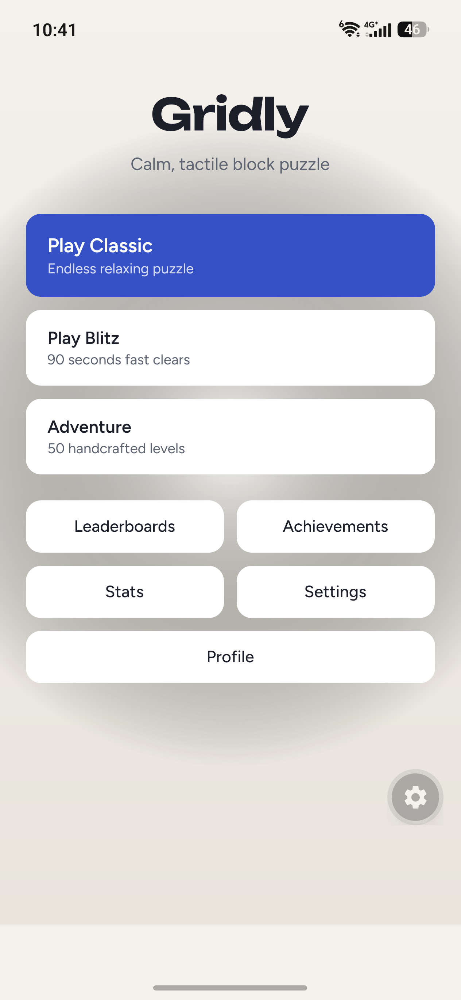
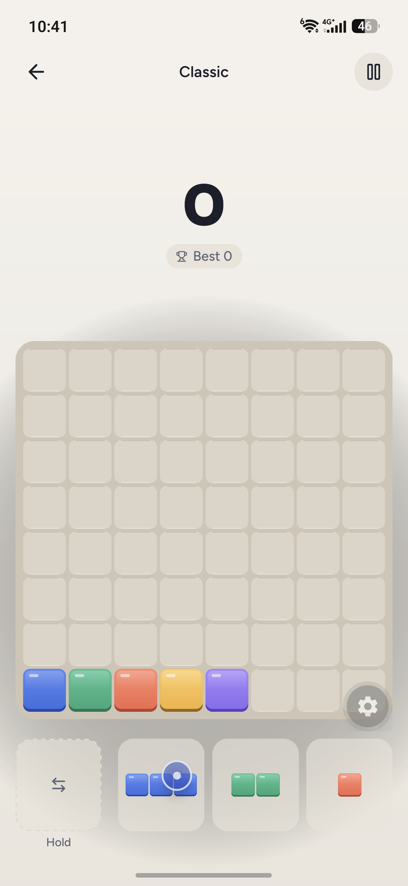
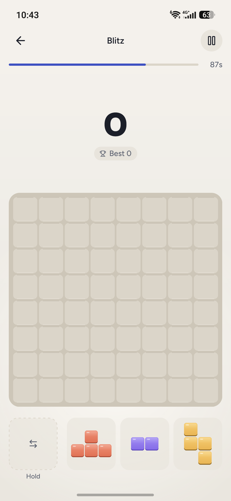
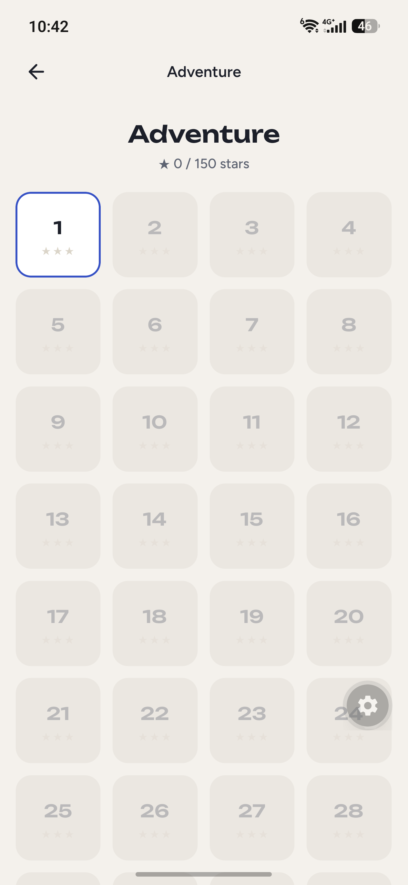

# Gridly

An open-source block puzzle game for Android and iOS. Drag pieces onto an 8×8 grid and clear full rows and columns. Built with Expo and React Native.

<p>
  
  
  
  
</p>

## Modes

- **Classic**: endless, resumes where you left off.
- **Blitz**: 90 seconds, and every cleared line adds time.
- **Adventure**: 50 levels with gems, locks and move limits.

No ads, no analytics, no trackers.

## Install

Download the latest APK from [Releases](https://github.com/DhrubaDC1/gridly/releases).

## Build

```bash
npm install
npx expo start                                   # dev server (Expo Go)
npm test                                         # tests
eas build --profile preview --platform android   # release APK
```

Without EAS: `npx expo prebuild --clean`, then `cd android && ./gradlew assembleRelease` (configure a release keystore first).

## License

MIT, see [LICENSE](LICENSE). Asset credits are in [CREDITS.md](CREDITS.md).
